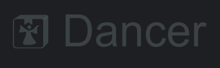

[](https://gist.github.com/cheerfulstoic/d107229326a01ff0f333a1d3476e068d)
[](https://github.com/Adalfarus/dancer/actions)
[](https://github.com/Adalfarus/dancer/blob/main/LICENSE)

[//]: # (<div style="display: flex; align-items: center; width: 100%;">)

[//]: # (    )

[//]: # (    <p style="margin: 0 0 0 2vw; font-size: 10vw; color: #3b4246;">Dancer</p>)

[//]: # (</div>)


dancer is a simple, and user-friendly Python library for creating competent apps.

## Compatibility
🟩 (Works perfectly); 🟨 (Untested); 🟧 (Some Issues); 🟥 (Unusable)

| OS                       | UX & README instructions | Tests | More Complex Functionalities |
|--------------------------|--------------------------|-------|------------------------------|
| Windows                  | 🟩                       | 🟩    | 🟩                           |
| MacOS                    | 🟨                       | 🟩    | 🟨                           |
| Linux (Ubuntu 22.04 LTS) | 🟩                       | 🟩    | 🟨                           |

## Features

- Makes user-specific storage easy
- Comes with various data storage and encryption build-in [IN THE FULL RELEASE]
- Sets up a good environment for your app to run in
- Helps a lot with GUI development
- Supports Windows, Linux and MacOS

## Installation

INFO: Currently only qt is supported, please use dancer[qt] always.

You can install dancer via pip:

```sh
pip install dancer --upgrade
```

you might want to install a specific GUI option like Qt or tkinter:

```sh
pip install dancer[qt] --upgrade
```

Or clone the repository and install manually:

```sh
git clone https://github.com/Adalfarus/dancer.git
cd dancer
python -m build
```

## Usage

Here are a few quick examples of how to use dancer:

- Examples will be added in the full release.

(If you have problems with the package please use `py -3.12 -m pip install dancer --upgrade --user`)

## Naming convention, dependencies and library information
[PEP 8 -- Style Guide for Python Code](https://peps.python.org/pep-0008/#naming-conventions)

For modules I use 'lowercase', classes are 'CapitalizedWords' and functions and methods are 'lower_case_with_underscores'.

### Information
- Additional information will be added in the full release.

## Contributing

We welcome contributions! Please see our [contributing guidelines](https://github.com/adalfarus/dancer/blob/main/CONTRIBUTING.md) for more details on how you can contribute to dancer.

1. Fork the repository
2. Create your feature branch (`git checkout -b feature/AmazingFeature`)
3. Commit your changes (`git commit -m 'Add some AmazingFeature'`)
4. Push to the branch (`git push origin feature/AmazingFeature`)
5. Open a pull request

### Aps Build master

You can use the aps_build_master script for your os to make your like a lot easier.
It supports running tests, installing, building and much more as well as chaining together as many commands as you like.

This example runs test, build the project and then installs it
````commandline
call .\aps_build_master.bat 234
````

````shell
sudo apt install python3-pip
sudo apt install python3-venv
chmod +x ./aps_build_master.sh
./aps_build_master.sh 234
````

## License

dancer is licensed under the LGPL-2.1 License - see the [LICENSE](https://github.com/adalfarus/dancer/blob/main/LICENSE) file for details.
